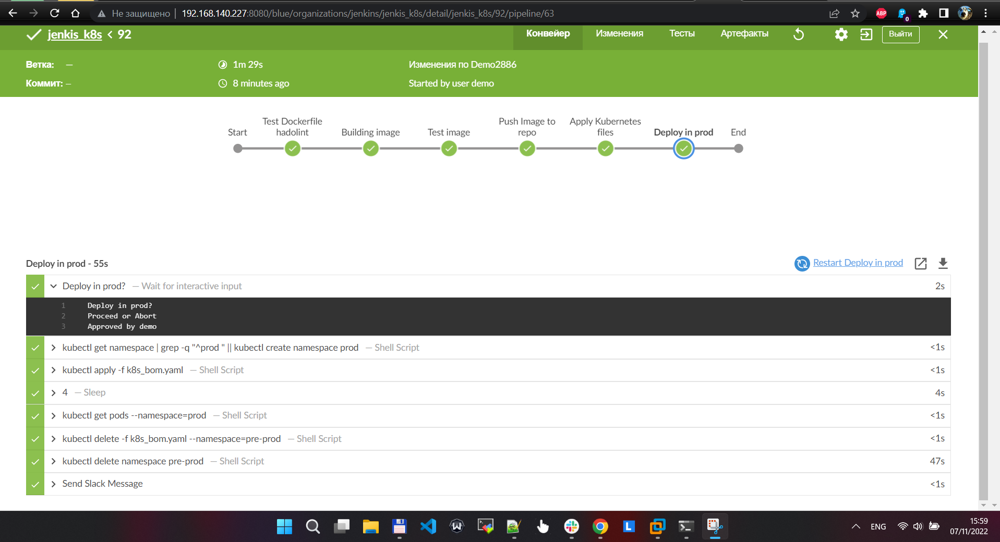
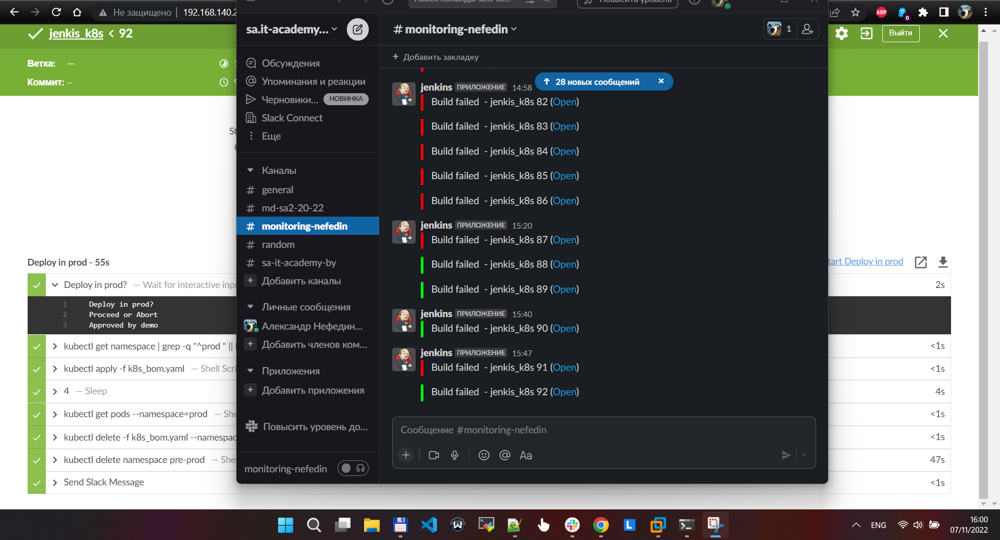
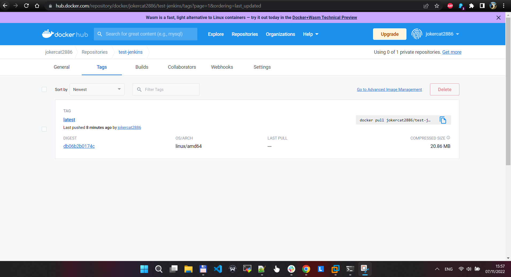

# Completing a DevOps test task for IT Bootcamp participants!

### For testing and quick setup of the K8s environment, I chose KIND.
Repository links >> [KIND](https://github.com/kubernetes-sigs/kind)!!!


### This command will copy kubeconfig to the root directory of the jenkins user. After that, you can use `bash kubectl` and use it in the jenkins pipeline.

```bash
sudo cp ~/.kube/config ~jenkins/.kube/
sudo chown -R jenkins: ~jenkins/.kube/
```


### Final image




